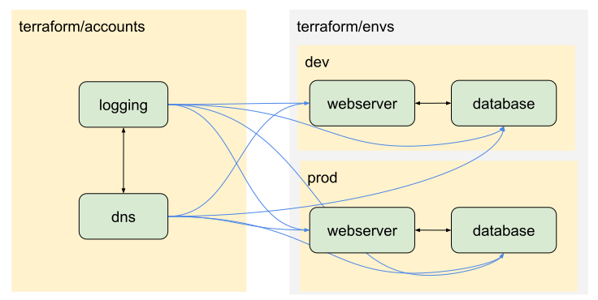

Fogg is a code generator that standardizes terraform configuration across your infrastructure and makes it easier to manage smaller terraform workspaces and increase code reuse.

## TL;DR:
How fogg works / how to use it in a nutshell:
1. Create a `fogg.yml` in the root of a new terraform repository.
2. Run `fogg apply` in the root of your repository to generate all the workspaces specified in the `fogg.yml` file. In addition, fogg writes to each workspace:
  - a `Makefile` that acts as a smart proxy for `terraform` cli commands
  - a `fogg.tf` that configures providers, default variables, state storage, and remote-state data sources for other workspaces in the repository.
3. Every time you make changes to `fogg.yml`, run `fogg apply` to update the files that fogg manages.
4. Edit your terraform configuration in one of the workspaces that fogg created. Run `make plan` and `make apply` instead of `terraform plan/apply` to apply your changes.
5. Commit your code, including fogg-generated files.

## Fogg concepts
### Accounts, Environments and Components
Fogg encourages you to organize terraform configurations into `accounts` and `environments`.  Environments are further subdivided into `components`

All of these workspaces support full Terraform functionality, but fogg creates [remote state](https://www.terraform.io/docs/providers/terraform/d/remote_state.html) relationships differently in each case:

- The remote state for all `accounts` is accessible by all other workspaces in the repository
- The remote state for a given `component` is accessible by all `components` in the same `environment`
- Refer to another workspace's remote state as `data.terraform_remote_state.{workspace_name}.outputs.{outputvar}`. This means that name collisions between account workspace names and component names are possible.

#### Remote state relationships

## Features
- Configures remote state storage and locking in one place, and applies it to every workspace
- Standardizes repository layout and dependencies between workspaces
